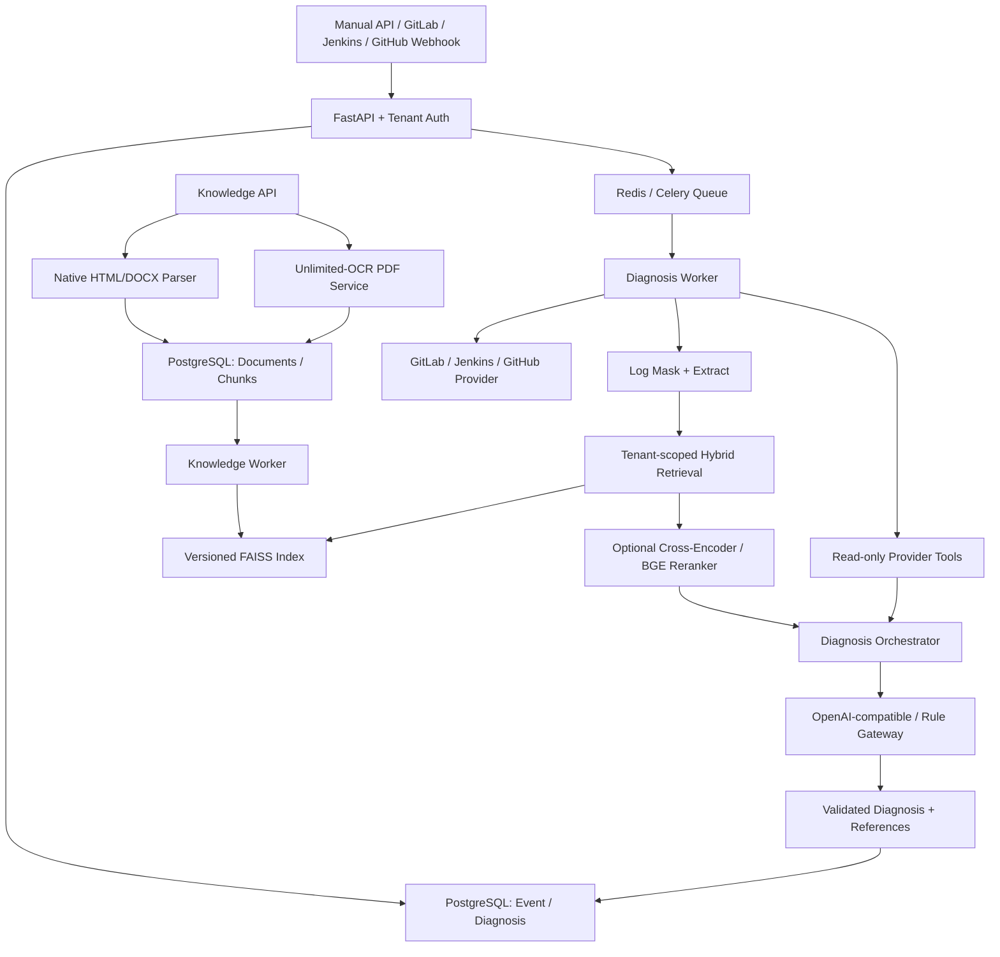

# CI Assistant Platform

可私有化部署的 CI 失败诊断平台。统一接入 GitLab、Jenkins 和 GitHub Actions，通过 PostgreSQL、
Redis/Celery、版本化 FAISS 知识索引以及 OpenAI-compatible 或本地规则诊断网关，
生成可追踪、带真实引用的结构化诊断。

## 产品定位

这个项目定位为“研发效能平台中的 AI 排障助手”，优先解决 CI 失败后开发者需要翻日志、查历史 case、问同事和重复定位的问题。

目标用户：

- 开发工程师：快速理解 CI 失败原因和下一步排查动作。
- DevOps / 平台工程师：沉淀高频失败类型、知识库和排障流程。
- 技术负责人：观察失败趋势、减少重复沟通和低效排障时间。

核心价值：

- 把非结构化 CI 日志转成稳定 JSON。
- 用 RAG 引入团队故障手册和历史经验。
- 用工具上下文补充 pipeline/job 运行时信息。
- 用评测脚本衡量 schema、分类、引用和关键词覆盖质量。
- 为后续自动评论 PR、创建 issue、推荐修复方案和 Agent 化排障打基础。

## 功能能力

- `/api/v1/diagnoses/logs` 与 `/runs` 统一诊断入口
- GitLab/Jenkins/GitHub Actions Provider、连接测试、只读工具、已验证 Webhook
  和全投递脱敏审计
- PostgreSQL 业务持久化、Redis/Celery 异步任务与 Alembic 迁移
- Markdown/JSON/HTML/DOCX/PDF 知识上传、Unlimited-OCR PDF 解析、版本化 FAISS 原子发布
- 可配置 Cross-Encoder/BGE Reranker，异常时自动降级到 Hybrid 排序
- Hybrid/Reranker 离线排序评测、诊断反馈闭环和本地 embedding cache
- tenant/project/provider ACL 混合检索与真实 references
- 默认关闭的只读 Agent 模式，具备轮次、工具、超时、上下文和估算 Token 硬预算
- Bearer API Key 租户隔离、Secret Mask、结构化校验、降级和 Prometheus 指标
- 18 Case GitLab/Jenkins 固定评测集及 Docker Compose 五服务部署

## 架构图



## 目录结构

```text
ci-assistant-platform/
├── ci_assistant/              # 主运行包
│   ├── api/                   # API、鉴权、健康检查与指标
│   ├── diagnosis/             # 日志预处理和诊断编排
│   ├── knowledge/             # 文档处理、混合检索和 FAISS 索引
│   ├── persistence/           # SQLAlchemy、Repository 和 Alembic
│   ├── providers/             # GitLab/Jenkins/GitHub Actions Provider
│   ├── tools/                 # Provider-aware 只读工具
│   └── workers/               # Celery 诊断与知识任务
├── ci_analysis_demo/          # 旧 API 兼容包，仅维护兼容性
├── docs/                      # 产品化、架构、评测、简历和面试材料
├── Dockerfile
├── Makefile
├── pyproject.toml
├── .env.example
└── requirements.txt
```

## 快速启动

```bash
cp .env.example .env
cp config.example.yml config.yml
# 设置 .env 中的 POSTGRES_PASSWORD
docker-compose up -d --build
curl http://127.0.0.1:8080/health/ready
```

本地开发：

```bash
python -m venv venv
venv/bin/pip install -e ".[dev]"
venv/bin/alembic upgrade head
venv/bin/uvicorn ci_assistant.main:app --reload --port 8080
```

项目开发安装推荐使用：

```bash
pip install -e ".[dev]"
pytest
```

## 平台配置

新平台配置采用以下覆盖顺序：

```text
代码默认值 < config.yml < 环境变量 < Secret 文件
```

复制配置模板后，可通过环境变量指定配置和 Secret 目录：

```bash
cp config.example.yml config.yml
export CI_ASSISTANT_CONFIG=config.yml
export CI_ASSISTANT_SECRET_DIR=secrets
```

普通环境变量（如 `LLM_API_URL`）和嵌套变量（如
`CI_ASSISTANT__KNOWLEDGE__CONTEXT_MAX_CHARS`）均受支持。Secret 文件名使用对应环境变量名，
文件内容为值，例如 `secrets/LLM_API_KEY`。`config.yml` 和 `secrets/` 默认不会提交到 Git。

Reranker 默认关闭。本地 SentenceTransformers 后端使用：

```bash
pip install -e ".[dev,reranker]"
export CI_ASSISTANT__KNOWLEDGE__RERANKER__BACKEND=local
```

生产环境也可设置 `BACKEND=http` 使用独立 BGE 兼容 `/rerank` 服务。两种后端异常时均
自动回退 Hybrid 排序，详细配置和容量边界见
[运维说明](docs/platform_operations.md#cross-encoderbge-reranker)。

平台数据层使用 SQLAlchemy 2.x 异步接口和 `asyncpg`。`Database` 负责 Engine 生命周期和
事务级 Session：上下文正常退出时提交，发生异常时回滚，Repository 本身不擅自提交事务。

接口文档：

```text
http://127.0.0.1:8080/docs
```

容器状态和日志：

```bash
docker-compose ps
docker-compose logs -f api worker
```

## API 示例

生产环境 API 使用 Bearer API Key，并由 `API_KEYS_JSON` 将 Key 绑定到租户。开发环境未配置
API Key 时可直接调用。

```bash
curl -X POST "http://127.0.0.1:8080/api/v1/diagnoses/logs" \
  -H "Authorization: Bearer ${CI_ASSISTANT_API_KEY}" \
  -H "Content-Type: application/json" \
  -d '{
    "tenant_id": "00000000-0000-0000-0000-000000000001",
    "log_text": "ModuleNotFoundError: No module named requests"
  }'
```

旧 `ci_analysis_demo` 接口仅在兼容期保留；新接入必须使用 `/api/v1`。兼容示例如下：

RAG + 工具上下文分析：

```bash
curl -X POST "http://127.0.0.1:8080/ci/analyze-log" \
  -H "Content-Type: application/json" \
  -d '{
    "project_name": "demo-project",
    "pipeline_id": "pipeline-001",
    "job_name": "unit-test",
    "log_text": "ModuleNotFoundError: No module named requests",
    "use_rag": true,
    "use_tools": true,
    "tool_mode": "rule"
  }'
```

响应结构：

```json
{
  "error_type": "dependency_missing",
  "summary": "缺少 requests 依赖，导致模块导入失败。",
  "reason": "日志中出现 ModuleNotFoundError，说明当前运行环境未安装 requests。",
  "suggestions": [
    "检查 requirements.txt 是否声明 requests",
    "确认 CI 中执行了 pip install -r requirements.txt"
  ],
  "confidence": "high",
  "references": [
    {
      "id": "docs-001",
      "title": "Python 构建中 ModuleNotFoundError 排查",
      "source": "故障手册",
      "content": "...",
      "category": "dependency",
      "tags": ["python", "ci"]
    }
  ],
  "trace_id": "optional-trace-id",
  "fallback_used": false
}
```

更多示例见 [API 示例](docs/api_examples.md)。

## 评测

启动服务后运行：

```bash
make eval
make eval-rag
make eval-ranking
```

核心指标：

- Schema valid rate：响应是否符合 Pydantic schema
- Error type accuracy：错误类型是否命中标注
- Top-k reference hit rate：RAG 引用是否命中期望知识文档
- Avg keyword score：原因和建议是否覆盖关键排查词

`make eval-ranking` 是主平台固定离线排序基线，不需要启动服务或加载真实模型。诊断完成后
可通过 `POST /api/v1/diagnoses/{diagnosis_id}/feedback` 提交评分和建议采纳状态，并通过
同路径 GET 或 `/api/v1/feedback/summary` 查询。

## 产品边界

0.6.2 默认只分析和建议，不自动修改代码或重跑 Pipeline。实验性 Agent 模式仍只调用现有
只读工具，并且必须由请求和平台配置双重启用。部署方仍需提供最小权限
CI Token、TLS、网络出口策略、备份、镜像扫描和 API Key 轮换。Web 管理页、自动评论和
人工审批后的写操作属于后续版本。

## 工程化材料

- [快速接手](docs/PROJECT_ONBOARDING.md)
- [架构说明](docs/architecture.md)
- [开发与验证](docs/DEVELOPMENT.md)
- [当前待办](docs/TODO.md)
- [Agent 化优化路线图](docs/agent_optimization_plan.md)
- [工程决策](docs/DECISIONS.md)
- [安装与运维](docs/platform_operations.md)
- [API 示例](docs/api_examples.md)
- [评测说明](docs/evaluation.md)
- [MVP 范围基线](docs/ci_assistant_platform_mvp.md)
- [MVP 验收记录](docs/mvp_acceptance_report.md)
- [安全验证](docs/security_verification.md)
- [RAG 和 Tool Calling 区别](docs/rag_vs_tool_calling.md)
- [Tool 调用优化全过程](docs/tool_calling_optimization.md)
- [今日面试速查](docs/interview_today_guide.md)
- [Agent 技术面试速查](docs/agent_concepts_interview_guide.md)
- [简历项目描述最终版](docs/resume_project.md)
- [面试专项题库](docs/interview_qna.md)
- [3 分钟自我介绍与 8 分钟项目讲解](docs/presentation_scripts.md)
- [项目讲解稿](docs/interview_script.md)

## 简历一句话

基于 FastAPI、LLM、RAG、Tool Context 和 Pydantic 构建 AI CI 日志分析助手，将 CI 失败日志转化为可追溯、可评测、可集成的结构化诊断结果，为研发效能平台中的自动化排障和 Agent 化工作流打基础。

## 后续路线

当前优先级和后续路线统一维护在 [治理与产品待办](docs/TODO.md)，README 不重复维护任务状态。
