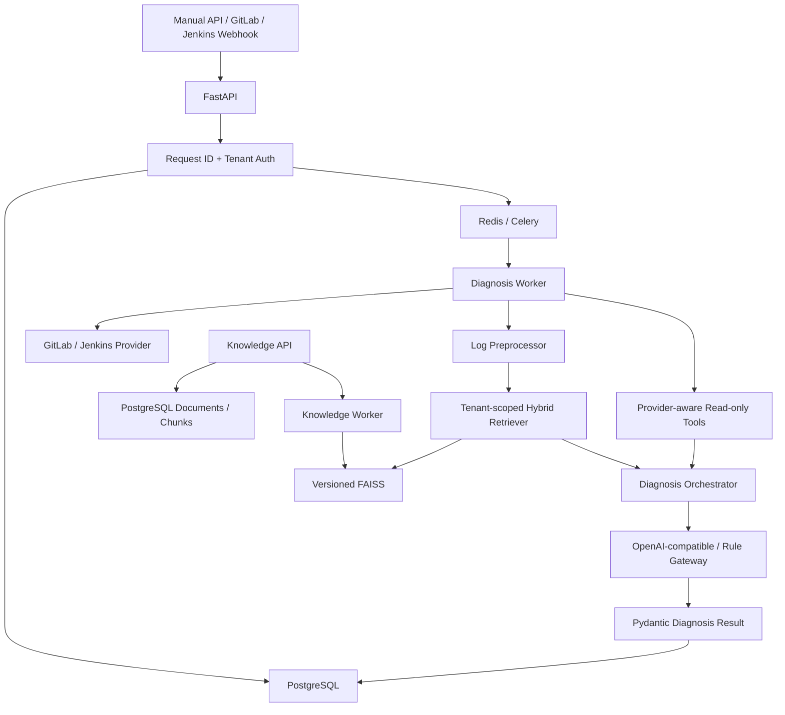

# CI Assistant Platform 架构

本文描述 `ci_assistant` 0.5.0 的实际运行架构。旧包 `ci_analysis_demo` 只承担兼容职责，
不再作为新功能的目标架构。

## 系统数据流



同步 API 只负责校验、持久化和派发任务；日志诊断、Provider 调用与知识索引在 Celery
Worker 中执行。诊断结果、引用和 Trace 写入 PostgreSQL，Redis 只保存队列及短期任务结果，
FAISS 保存版本化向量索引。

## 运行组件

| 组件 | 实现 | 职责 |
| --- | --- | --- |
| API | FastAPI | 鉴权、路由、健康检查、指标和任务派发 |
| Worker | Celery | 异步诊断、知识入库和索引重建 |
| Database | PostgreSQL + SQLAlchemy | 租户、连接、事件、诊断、Trace 和知识元数据 |
| Queue | Redis | Celery broker/backend，不保存知识正文 |
| Vector index | FAISS | 租户级版本索引和原子 `CURRENT` 切换 |
| Migration | Alembic | PostgreSQL Schema 版本管理 |
| AI gateway | OpenAI-compatible / Rule | 结构化诊断和离线降级 |

Docker Compose 定义 `api`、`worker`、`migrate`、`postgres` 和 `redis` 五个服务。

## 主包模块

| 路径 | 职责 |
| --- | --- |
| `ci_assistant/api/` | API、鉴权、错误 Envelope、健康检查和 Prometheus 指标 |
| `ci_assistant/domain/` | CI 与 Tool 领域模型 |
| `ci_assistant/providers/` | Provider Protocol、Registry、GitLab 和 Jenkins Adapter |
| `ci_assistant/diagnosis/` | 日志脱敏、关键片段提取和诊断编排 |
| `ci_assistant/llm/` | OpenAI-compatible 与规则诊断网关 |
| `ci_assistant/knowledge/` | 文档处理、Embedding、混合检索和 FAISS 发布 |
| `ci_assistant/tools/` | 按 Capability 和项目策略过滤的只读工具 |
| `ci_assistant/persistence/` | 数据模型、Repository、事务和 Alembic |
| `ci_assistant/workers/` | diagnosis/knowledge 队列任务 |

## 核心边界

### Provider 边界

业务编排只依赖统一 `CIProvider`，不直接消费 GitLab/Jenkins 原始响应。Provider 负责状态、
Run、Job、Log、Change 和 Webhook 的统一映射，并通过 Capability 声明可用读能力。

### 诊断边界

日志在进入检索、Tool 或模型前执行长度控制、错误片段提取和 Secret Mask。日志、知识和
Tool Result 在 Prompt 中均标记为不可信证据。单个 Tool 或 RAG 失败允许降级，最终输出必须
通过 `DiagnosisResult` 校验。

### 知识边界

知识正文、版本、来源和 ACL 位于 PostgreSQL；Chunk 向量位于 FAISS。检索必须同时携带
tenant/project/provider 过滤条件。引用由真实检索结果覆盖，模型不能自行生成引用来源。

### 安全边界

- 生产 API Key 绑定租户，管理连接只允许管理员 Key。
- GitLab/Jenkins Webhook 必须验证共享 Secret。
- 默认 Tool 全部只读；写操作不属于 0.5.0 自动执行范围。
- 容器使用非 root 用户。
- PostgreSQL 的本地调试端口只绑定 `127.0.0.1`，生产密码不允许使用 Compose 默认值。

## 持久化关系

```text
tenants
├── ci_connections
│   ├── projects
│   └── ci_events
├── diagnoses
│   └── analysis_traces
└── knowledge_documents
    ├── knowledge_chunks
    └── ingestion_jobs
```

`evaluation_runs` 独立保存评测版本和指标。数据库变更只能通过新增 Alembic revision 完成。

## 兼容层

`ci_analysis_demo` 保留旧 `/ci/*` API 和原型评测链路，避免已有调用方立即中断。新功能、
数据模型、Provider、Worker 和知识索引不得继续依赖该包。兼容层退役前必须确认调用方迁移，
并以新旧接口回归测试保护公开行为。

## 设计原则

1. references 只能来自真实检索结果。
2. 默认只读，外部写操作必须独立授权。
3. 在线查询与离线知识入库分离。
4. Provider、LLM、RAG 和 Tool 失败具有稳定错误边界或降级行为。
5. 配置按默认值、YAML、环境变量、Secret 文件分层覆盖。
6. 公开 API、数据库迁移和兼容包变更必须有回归证据。
