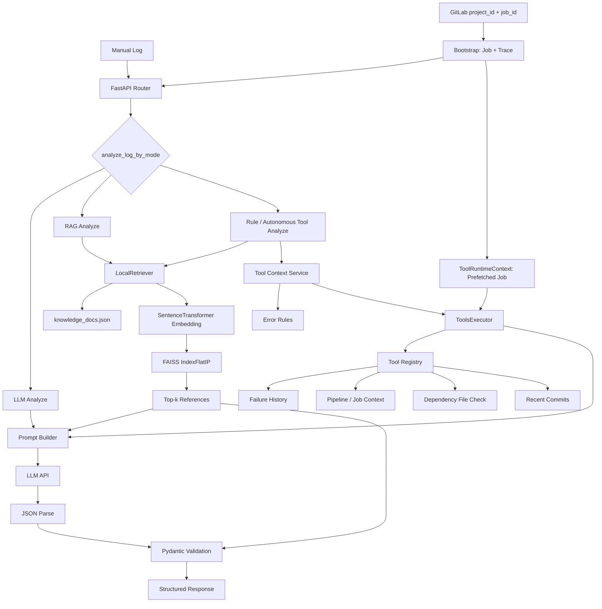
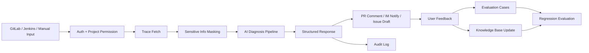

# 架构说明

## 整体流程



## 模块说明

| 模块 | 作用 |
| --- | --- |
| `routers/` | API 路由，负责接收请求和异常转换 |
| `schemas/` | Pydantic 请求和响应结构 |
| `services/llm_service.py` | Prompt 构造、LLM 调用、重试、响应校验 |
| `services/rag_retriever.py` | 本地知识库 Hybrid Search、规则重排和 FAISS 检索 |
| `services/tool_context_service.py` | 基于日志、错误规则和请求上下文选择工具并聚合结果 |
| `services/tool_calling_service.py` | 解析模型返回的 tool_calls，并通过 executor 受控执行 |
| `tools/base.py` | ToolSpec、ToolResult、ToolContext、ToolRuntimeContext 等统一模型 |
| `tools/schemas.py` | 工具元信息和参数 schema |
| `tools/executor.py` | 工具注册、筛选、执行、依赖注入、异常隔离和耗时记录 |
| `tools/` | 历史故障、GitLab 上下文、依赖文件检查、近期提交等工具 |
| `knowledge_docs/` | RAG 知识库和评测样例 |
| `scripts/evaluate_ci_assistant.py` | 离线评测脚本 |

## 产品化架构补充



产品化后，核心链路需要增加四层：

- 权限层：用户只能分析自己有权限的项目和 job。
- 安全层：CI trace 在进入 LLM 前做关键行提取、长度截断和敏感信息脱敏。
- 审计层：记录 trace_id、项目、job、模型版本、检索命中文档、工具调用、耗时、fallback 和错误信息。
- 反馈层：收集 helpful / not helpful / accepted suggestion，反哺评测集、知识库和 Prompt。

## 关键设计

### 1. LLM 输出必须二次校验

LLM 返回 JSON 后，不直接透传给前端，而是经过：

```text
json.loads -> AnalysisLogResponse.model_validate
```

这样可以避免字段缺失、枚举非法、建议为空等问题进入下游系统。

### 2. references 由 retriever 决定

RAG 场景下，引用依据不交给模型自由生成。模型负责分析结论，服务端用真实检索到的 top-k 文档覆盖 `references`，保证引用可追溯、可评测。

### 3. 工具调用从规则版演进为可治理执行层

当前工具调用以规则选择为主：服务端根据日志提取关键字，再结合 tool tags、trigger_keywords、read_only、provider 等元信息选择工具。执行层统一由 `ToolsExecutor` 负责，单个工具失败不会打崩主流程。

这个做法比一开始就接模型自主 tool calling 更稳定，也更适合作为学习项目第一版。后续可以在同一个 executor 之上接入模型自主 tool_calls，实现受控 Tool Calling。

### 4. 评测拆成四类指标

- schema 是否有效：服务稳定性
- error_type 是否准确：分类能力
- references 是否命中：RAG 检索质量
- keyword score：原因和建议是否覆盖关键排查点

### 5. 安全边界优先于自动动作

当前系统默认只输出分析和建议，不自动修改代码、不自动重跑 pipeline。后续如果加入 Tool Calling，需要按风险分层：

- 读取类工具：查询 job、trace、历史 case，默认允许。
- 低风险写入：评论 PR 或发送 IM，需要项目授权。
- 中高风险动作：创建 issue、重跑 pipeline，需要 Maintainer 确认。
- 高风险动作：自动提交修复 MR，必须人工 review。

### 6. GitLab 最小采集与按需调查

`/ci/analyze-gitlab-job` 会强制获取 Job 和 Job Trace，因为 Trace 是错误识别、RAG Query 和工具选择的初始输入。Pipeline、最近提交和依赖文件不是每次分析都需要，因此不在入口处预取，而是交给规则工具或 Autonomous Tool Calling 按需查询。

```text
project_id + job_id
  -> get_job + get_job_trace（最小启动数据）
  -> primary_error / RAG / Tool Selection
  -> pipeline / commits / dependency（按需工具调用）
```

预取 Job 通过请求级 `ToolRuntimeContext` 传给工具。如果模型再次调用 `query_job_context`，工具会先读取本次请求的缓存；只有 ID 不匹配或缓存不存在时才访问 GitLab API。该上下文不会写入全局 `ToolsExecutor`，避免并发请求之间串数据。
