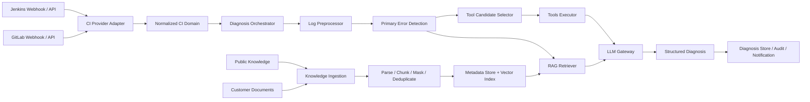

# CI 智能诊断平台产品化分析

> 文档状态：评审通过  
> 基线日期：2026-07-24  
> 评审日期：2026-07-24  
> 分析对象：`ci_analysis_demo`

## 1. 分析结论

将当前项目升级为可在客户内网部署的通用 CI 智能诊断平台，技术上可行。

当前项目已经完成日志诊断主链路的验证，包括结构化输出、RAG、多路召回、动态 Tool Calling、GitLab Job 数据获取和离线评测。下一阶段不应继续以增加 Prompt 和单点工具函数为主，而应重点建设 Provider 抽象、事件驱动、持久化、知识入库、权限隔离和可运维能力。

推荐的产品形态是：

- 每个客户环境部署一套服务，而不是每个代码仓库复制一套服务。
- 一套服务可以连接多个 GitLab、Jenkins 实例和多个项目。
- 客户通过环境变量或配置文件提供 AI、CI、数据库和知识库配置。
- 代码仓库可以选择维护轻量 `.ci-assistant.yml`，覆盖项目级诊断策略。
- 平台默认只读分析，任何重跑、评论、创建 Issue 等写操作都需要显式授权。

综合判断：

| 维度 | 判断 | 说明 |
| --- | --- | --- |
| 技术可行性 | 高 | FastAPI、CI API、RAG、Tool Calling 均已有实现基础 |
| MVP 实现复杂度 | 中 | 主要工作集中在抽象、持久化、Webhook 和 Jenkins 适配 |
| 私有化部署可行性 | 高 | 可以通过 Docker Compose 提供单机私有部署 |
| 知识库通用化 | 中高 | 需要补充文档规范、入库流程、权限和索引生命周期 |
| 生产风险 | 中高 | CI 日志敏感、Jenkins 差异大、LLM 结果需要审计和降级 |

## 2. 当前项目能力基线

### 2.1 已具备能力

- FastAPI API 服务和统一日志分析入口。
- LLM、RAG、规则 Tool、自主 Tool Calling 多种分析模式。
- GitLab Project、Pipeline、Job、Trace、Commit 和仓库文件 API。
- 日志关键行提取和基础敏感信息脱敏。
- `ToolSpec`、`ToolsExecutor`、触发关键词和候选工具过滤。
- `RAGResult`、Semantic/Keyword/Metadata 三路召回和规则重排。
- references 由检索结果统一回填。
- AnalysisTrace 记录 RAG、工具调用、模型调用和耗时信息。
- Pydantic 结构化响应校验、重试、异常映射和 fallback。
- Dockerfile、`.env.example`、README 和离线评测脚本。

### 2.2 当前限制

- 配置只能表达一个 GitLab 实例，不能表达多个 CI 连接。
- 没有 Jenkins Provider。
- 业务服务直接依赖 `GitLabClient`，尚未建立统一 CI 领域接口。
- `ToolSpec.provider` 表示工具执行方式，但没有独立表达 CI Provider。
- ToolsExecutor 目前只实现本地 Python 函数执行。
- 应用启动时读取单个 JSON 文件、重新生成所有 embedding 和 FAISS 索引。
- 没有数据库、数据库迁移、任务队列、Webhook 幂等和分析记录持久化。
- 历史失败工具仍使用 mock 数据。
- 没有知识文档上传、版本、审核、发布、删除和重新索引流程。
- 没有租户、项目权限、知识 ACL、连接凭据审计。
- 当前 24 篇知识文档和 20 个评测用例只适合作为功能验证数据。

## 3. 产品边界

### 3.1 MVP 要解决的问题

1. 客户使用 Docker Compose 一次启动平台。
2. 客户配置 OpenAI-compatible 模型、GitLab 和 Jenkins 连接。
3. CI 失败后通过 API 或 Webhook 触发诊断。
4. 平台按需读取 CI 上下文和失败日志。
5. 平台结合公共知识和客户私有知识生成结构化诊断。
6. 每次诊断都有引用、调用轨迹、耗时和可追踪的结果记录。
7. 客户可以按照规定文档结构上传、更新和删除内部知识。

### 3.2 MVP 不解决的问题

- 不自动修改客户代码。
- 不自动重跑 Pipeline 或 Jenkins Build。
- 不直接创建 Merge Request、Pull Request 或提交。
- 不建设复杂前端管理台，先以 API 和管理命令为主。
- 不同时支持所有 CI 产品，首期只支持 GitLab 和 Jenkins。
- 不在首期接入复杂 Agent 多轮自治和自动修复闭环。
- 不在首期引入大型训练平台或模型微调平台。

## 4. 推荐部署模型

不推荐：

```text
每个代码仓库 clone 一份完整 AI 服务
```

这种方式会导致版本分散、凭据重复、模型重复加载、知识无法共享和升级困难。

推荐：

```text
客户环境
├── ci-assistant-api
├── ci-assistant-worker
├── postgres
├── redis
├── knowledge-storage
└── vector-index

多个 GitLab/Jenkins 项目
          ↓
共享同一套客户内网服务
```

系统配置和项目配置分层：

- 系统配置：AI Provider、CI 连接、数据库、队列、存储、默认策略。
- 项目配置：项目标识、知识作用域、语言、构建命令、Tool 权限、通知策略。
- 密钥配置：只通过环境变量、Docker Secret 或外部 Secret Manager 注入。

## 5. 目标架构



## 6. CI Provider 抽象

核心服务不应该知道 GitLab Job JSON 或 Jenkins Build JSON 的具体字段。

建议统一领域对象：

- `CIConnection`
- `ProjectRef`
- `PipelineRun`
- `JobRun`
- `LogArtifact`
- `CommitChange`
- `TestSummary`
- `ProviderCapability`

建议统一接口：

```python
class CIProvider:
    async def get_project(self, project_ref: str): ...
    async def get_run(self, project_ref: str, run_id: str): ...
    async def list_jobs(self, project_ref: str, run_id: str): ...
    async def get_job(self, project_ref: str, job_id: str): ...
    async def get_job_log(self, project_ref: str, job_id: str): ...
    async def list_changes(self, project_ref: str, run_id: str): ...
    async def verify_webhook(self, headers: dict, body: bytes): ...
    async def parse_webhook(self, payload: dict): ...
```

Provider 应声明能力，编排器只调用其支持的功能。这样可以处理 Jenkins 插件、版本和 Pipeline 类型不同造成的能力差异。

`ToolSpec` 建议将两个概念拆开：

```text
executor_kind: python | http | mcp | skill
ci_provider: gitlab | jenkins | github | generic
capabilities: job.read | log.read | repository.read | history.read
```

## 7. Warp diagnose-ci-failures Skill 分析

该 Skill 是 GitHub CLI 驱动的确定性排障流程，主要步骤是：

1. 确认当前分支存在 PR。
2. 获取所有 CI Check 状态。
3. 获取失败 Run 的日志。
4. 按格式、Lint、编译、测试和平台问题分类。
5. 生成修复计划，等待用户确认，不直接修改代码。

值得吸收的设计：

- 先收集事实证据，再让模型判断。
- 区分成功、失败和运行中的检查。
- 对多个错误先分类，再确定处理顺序。
- 默认输出计划，写操作需要人工确认。
- 最终输出包含验证步骤。

不能直接照搬的部分：

- 强依赖 GitHub CLI 和 PR，不适用于 GitLab/Jenkins 通用平台。
- 错误分类偏 Rust、Clippy、WASM 等原项目场景。
- 没有 RAG、客户知识、权限、审计和多连接管理。
- 没有服务端持久化、Webhook、任务队列和多请求并发模型。

推荐将其转化为平台内部的 `DiagnosisPolicy` 或 Workflow Template，而不是直接作为 Tool 调用。其抽象动作由 CI Provider 实现，例如：

```text
resolve_change_request
list_checks
wait_or_continue
collect_failed_logs
categorize_failures
build_diagnosis_plan
```

## 8. 公共 CI 数据可行性

可以使用网络公开数据构建初始知识库，但“公开可访问”不等于“可以任意复制和商业使用”。

推荐来源顺序：

1. GitLab、Jenkins、语言和构建工具的官方故障文档。
2. 明确声明开源许可证的 CI 故障数据集。
3. 许可证允许使用的开源项目日志、Issue、修复提交和 Pipeline 配置。
4. 根据真实错误模式构造并人工验证的合成案例。
5. 客户内部故障手册、历史工单和已脱敏 CI 失败记录。

每条外部知识必须记录：

```json
{
  "source_url": "https://example.com/document",
  "source_type": "official_doc",
  "license": "MIT",
  "retrieved_at": "2026-07-24T00:00:00Z",
  "content_hash": "sha256:...",
  "language": "zh-CN",
  "review_status": "approved"
}
```

禁止默认入库：

- 没有明确来源和许可证的整站抓取内容。
- 含访问令牌、Cookie、邮箱、内网域名和个人信息的原始日志。
- 无法区分事实和模型生成内容的自动回答。
- 没有版本和删除能力的不可追踪数据。

## 9. 客户私有知识设计

知识入库链路：

```text
上传
  ↓
文件与权限校验
  ↓
解析和标准化
  ↓
敏感信息扫描
  ↓
结构化 Chunk
  ↓
Metadata 校验
  ↓
去重和版本比较
  ↓
Embedding
  ↓
索引构建
  ↓
审核发布
```

首期支持 Markdown 和 JSON，后续再增加 PDF、DOCX、HTML 和工单系统同步。

每个 Chunk 至少包含：

- `tenant_id`
- `project_scope`
- `document_id`
- `chunk_id`
- `title`
- `content`
- `error_types`
- `ci_providers`
- `languages`
- `keywords`
- `source`
- `version`
- `acl`
- `status`

## 10. 主要风险

| 风险 | 影响 | MVP 对策 |
| --- | --- | --- |
| CI Token 权限过大 | 泄露代码和流水线数据 | 默认只读、最小权限、密钥不落日志 |
| CI 日志包含敏感信息 | 数据泄漏到外部模型 | 清洗后调用模型，支持客户内网模型 |
| Jenkins 实例差异 | API 字段和日志能力不一致 | Provider Capability 和兼容性测试矩阵 |
| 公共数据质量不稳定 | RAG 引用错误 | 来源分级、人工审核、评测集回归 |
| Prompt Injection | 诱导工具越权或泄密 | 输入分区、只读工具、参数校验、审计 |
| LLM 不稳定 | 输出错误或格式无效 | Pydantic 校验、重试、fallback、低置信度 |
| 同一故障重复触发 | 重复消费和重复费用 | Webhook 幂等键、任务状态和去重 |
| 多项目知识串用 | 客户内部数据越权 | tenant/project metadata filter 和 ACL |

## 11. 最终建议

保留当前分析编排、RAG、ToolSpec、Trace、GitLab Client 和评测能力，采用渐进式迁移，不进行一次性重写。

实施顺序应为：

```text
统一领域模型
→ GitLab Provider 迁移
→ 持久化与事件任务
→ Jenkins Provider
→ 私有知识入库
→ 检索和 Rerank 升级
→ 权限、反馈和自动化动作
```

## 12. 参考资料

- [Warp common-skills 原始仓库](https://github.com/warpdotdev/common-skills)
- [diagnose-ci-failures SKILL.md](https://raw.githubusercontent.com/warpdotdev/common-skills/main/.agents/skills/diagnose-ci-failures/SKILL.md)
- [GitLab Webhook Events](https://docs.gitlab.com/user/project/integrations/webhook_events/)
- [Jenkins Remote Access API](https://www.jenkins.io/doc/book/using/remote-access-api/)
- [GitHub Terms of Service](https://docs.github.com/en/site-policy/github-terms/github-terms-of-service)

对应 MVP 范围见 [CI 智能诊断平台 MVP](ci_assistant_platform_mvp.md)，实现设计见 [CI 智能诊断平台开发文档](ci_assistant_platform_development.md)。
