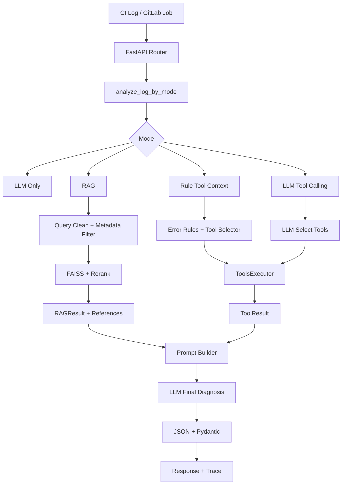

# 今日面试速查：AI CI 日志分析助手

## 1. 面试定位

这不是一个“调大模型接口”的 Demo，而是一个面向研发效能场景的 AI 排障服务。

一句话：

> 我做的是一个 AI CI 日志分析助手，用 FastAPI 把 LLM、RAG、Tool Calling、GitLab Job 接入、Pydantic 结构化校验和离线评测串成一个可服务化的研发效能诊断链路。

你要让面试官听到 5 个关键词：

- 研发效能：解决 CI 失败排障慢的问题。
- 工程化：FastAPI、Pydantic、异步调用、异常分层、fallback。
- RAG：引入团队故障手册和历史 case，让回答有依据。
- Tool Calling：查询 pipeline/job/依赖文件/近期提交等运行时上下文。
- 评测闭环：用 schema、分类、引用命中、关键词覆盖来衡量质量。

## 2. 最新项目结构讲法

当前项目已经从多接口 Demo 收敛到统一入口：

```text
POST /ci/analyze-log
```

通过请求参数控制链路：

- `use_rag=false, use_tools=false`：纯 LLM。
- `use_rag=true, use_tools=false`：RAG + LLM。
- `use_rag=true, use_tools=true, tool_mode=rule`：RAG + 规则工具上下文 + LLM。
- `use_rag=true, use_tools=true, tool_mode=llm`：RAG + LLM 自主 Tool Calling + LLM 最终诊断。

旧接口还保留但标记 deprecated：

- `/ci/analyze-rag-log`
- `/ci/analyze-tool-rag-log`
- `/ci/analyze-autonomous-tool-log`

真实 CI 接入入口：

```text
POST /ci/analyze-gitlab-job
```

它会拉取 GitLab Job 和 Trace，做关键行提取、敏感信息脱敏，再复用统一分析链路。

## 3. 90 秒项目开场

面试官您好，我这个项目叫 AI CI 日志分析助手，场景是研发团队里非常高频的 CI 构建或测试失败排查。

传统流程里，开发同学需要手动翻很长的 trace，判断是依赖缺失、测试失败、环境变量缺失、镜像拉取失败还是权限问题，还可能要查历史 case 或问平台同学。这个过程重复且低效，所以我把它做成一个 AI 效能服务。

系统用 FastAPI 提供统一接口 `/ci/analyze-log`，通过 `use_rag`、`use_tools` 和 `tool_mode` 选择不同分析链路。最简单是纯 LLM；进阶是 RAG，把团队故障手册和历史 case 检索出来；再进一步是 Tool Context，查询 pipeline、job、依赖文件和近期提交；最后还支持 LLM 自主选择工具的 Tool Calling 模式。

模型输出不会直接返回，而是经过 JSON 解析和 Pydantic 校验，保证 `error_type`、`suggestions`、`confidence`、`references` 等字段稳定。RAG 的 references 由后端检索结果回填，避免模型编造引用。项目还做了 trace_id、fallback、敏感信息脱敏、GitLab Job 接入和离线评测，用 schema 有效率、错误类型准确率、引用命中率和关键词覆盖率衡量效果。

所以这个项目的重点不是“能调模型”，而是把 LLM 放进一个可控、可追溯、可评测、可继续产品化的研发效能链路里。

## 4. 3 分钟项目讲解

### 背景

CI 失败排查是研发流程中的高频低效点。日志长、噪声多、错误类型多，开发者经常要重复查文档和历史经验。

### 目标

把 CI 失败日志转成结构化诊断结果：

- 错误类型
- 一句话摘要
- 判断原因
- 排查建议
- 置信度
- references
- trace_id
- fallback_used

### 架构

```text
FastAPI Router
  ↓
analyze_log_by_mode
  ↓
LLM / RAG / Rule Tools / LLM Tool Calling
  ↓
Prompt Builder
  ↓
LLM API
  ↓
JSON Parse
  ↓
Pydantic Validation
  ↓
Structured Response + Trace
```

### 技术亮点

1. 统一入口：用 `use_rag/use_tools/tool_mode` 调度不同分析链路，旧接口 deprecated 兼容。
2. RAG 优化：日志先做 query 清洗，再按 error_type 做 metadata filter，结合 FAISS 和 keyword/rule rerank。
3. Tool 调用：抽象 `ToolSpec`、`ToolsExecutor`、`ToolRuntimeContext`，支持规则工具和 LLM 自主工具。
4. GitLab 接入：拉取 job trace，关键行提取、脱敏、构造上下文，再进入统一分析。
5. 可靠性：timeout、retry、fallback、Pydantic 校验、trace 日志。
6. 评测：覆盖 schema、error_type、reference hit、keyword score。

### 结论

这是一个从 AI Demo 向 AI 效能产品演进的项目：既有模型能力，也有工程边界、工具体系和评测闭环。

## 5. 8 分钟项目讲解结构

### 0:00 - 1:00 背景和价值

CI 失败排查重复、高频、依赖经验，适合 AI 效能增强。项目目标是把非结构化 trace 转成结构化诊断结果。

### 1:00 - 2:00 服务入口设计

统一入口是 `/ci/analyze-log`，用参数选择模式：

- 纯 LLM：验证最小闭环。
- RAG：引入知识依据。
- rule tool：服务端稳定选择工具。
- llm tool：模型自主选择工具，再由后端受控执行。

旧接口保留 deprecated，是为了兼容评测和历史调用。

### 2:00 - 3:00 RAG 设计

RAG 不是简单 top-k。最新版做了：

- `extract_query_from_log`：从日志里提取关键错误行，减少噪声。
- `build_rag_filters`：根据 primary error 生成 metadata filter。
- `RAGResult`：统一管理 query、filters、documents、candidate_count、duration。
- context budget：控制注入 Prompt 的上下文长度。
- references 后端回填：避免模型编造引用。

### 3:00 - 4:20 Tool 调用设计

Tool 调用分两类：

- 规则版：服务端根据日志、error_type、tags、trigger_keywords 选择工具。
- 自主版：LLM 第一轮选择工具，后端解析 tool_calls，用 `ToolsExecutor` 受控执行，再第二轮生成最终诊断。

工具体系核心：

- `ToolSpec`：工具元信息。
- `CI_TOOLS_SCHEMA`：工具 schema 单一事实源。
- `ToolsExecutor`：注册、筛选、执行、依赖注入、异常隔离、耗时记录。
- `ToolRuntimeContext`：单次请求内传递预取数据，避免重复查 GitLab。

### 4:20 - 5:20 GitLab Job 接入

`/ci/analyze-gitlab-job` 会：

1. 拉取 job 信息。
2. 拉取 job trace。
3. 提取关键错误行。
4. 脱敏 token/password/secret/api_key。
5. 构造 `GitLabJobContext`。
6. 写入 `ToolRuntimeContext.prefetched`。
7. 复用 `analyze_log_by_mode`。

这说明项目不是只支持用户手动粘贴日志，也能向真实 CI 平台接入。

### 5:20 - 6:20 可靠性和安全边界

- LLM 调用有 timeout 和 retry。
- 模型输出必须 JSON parse + Pydantic 校验。
- LLM 失败可 fallback 到规则分析。
- trace_id 贯穿分析链路。
- RAG references 后端回填，不交给模型生成。
- Tool 默认 read_only，写入类动作后续要人工确认和审计。

### 6:20 - 7:20 评测闭环

项目有测试和评测：

- `test_analysis_dispatch`：验证不同 mode 分发正确。
- `test_rag_pipeline`：验证 query 清洗、metadata filter、rerank、context budget、references。
- 评测脚本统计 schema valid、error type accuracy、reference hit、keyword score。

### 7:20 - 8:00 总结和后续

后续要补：

- 接真实 GitLab/Jenkins webhook。
- 用户反馈接口。
- 工具选择 precision/recall。
- reranker 和 embedding cache。
- 权限、审计、Dashboard。
- 写入类 Tool Calling 的人机确认。

## 6. 架构图口述版



## 7. 必背知识点

### FastAPI

- `APIRouter` 做模块化路由。
- `Depends` 注入 retriever、tools_executor、gitlab_client。
- `response_model` 保证输出文档和响应结构。
- 异常统一转换为 HTTP 502/504。

### Pydantic

- `AnalysisLogRequest` 管请求边界。
- `AnalysisLogResponse` 管模型输出边界。
- `Literal` 限制 `error_type/confidence`。
- `Field(min_length/max_length)` 限制空值和建议数量。
- LLM 输出必须 `model_validate`。

### Async

- LLM、GitLab API、工具执行都是 I/O 密集。
- async 能避免阻塞事件循环。
- 工具函数兼容同步和异步，executor 用 `inspect.isawaitable` 处理。

### RAG

- query cleaning：去掉日志噪声。
- metadata filter：按 error_type 过滤候选文档。
- rerank：结合 semantic、keyword、metadata。
- context budget：控制 prompt 长度。
- references override：后端保证引用真实。

### Tool Calling

- Rule mode：后端稳定选择工具。
- LLM mode：模型第一轮选工具，后端执行，第二轮诊断。
- `ToolSpec`：工具说明和治理元信息。
- `ToolsExecutor`：统一执行和隔离异常。
- `ToolRuntimeContext`：单次请求缓存和预取上下文。

### 评测

- schema valid：输出结构是否稳定。
- error_type accuracy：分类是否正确。
- reference hit：RAG 是否命中知识。
- keyword score：建议是否覆盖关键排查点。
- 工具后续可加 precision/recall 和 latency p95。

## 8. 高频问题与答案

### Q1：这个项目为什么有业务价值？

CI 失败排查是高频低效场景。这个项目把人工翻日志、查文档、查历史 case 的过程服务化，能减少重复排障时间，并沉淀团队知识和评测数据。

### Q2：为什么不是纯 LLM？

纯 LLM 缺少团队内部知识和当前 pipeline 上下文，容易给泛化建议。RAG 补静态知识，Tool 补动态上下文，Pydantic 和评测保证输出可控。

### Q3：RAG 和 Tool Calling 区别？

RAG 查文档，解决“模型不知道团队资料”；Tool Calling 查系统状态或执行动作，解决“模型不能访问外部系统”。本项目里 RAG 查故障手册，Tool 查 job、pipeline、依赖文件、近期提交。

### Q4：为什么 references 后端回填？

引用必须可追溯。如果让模型生成 references，可能缺字段或编造文档。后端用真实 RAG top-k 回填，能保证引用真实，也方便评测 reference hit rate。

### Q5：rule tool 和 llm tool 怎么取舍？

rule tool 稳定、可控、容易审计，适合生产早期。llm tool 灵活，适合复杂场景，但要限制候选工具、只读权限、最大调用次数和参数校验。当前项目两种都支持。

### Q6：ToolExecutor 的设计亮点是什么？

它把工具从散落函数升级为统一执行层，支持注册、筛选、执行、依赖注入、异常隔离、耗时记录和结果裁剪。新增工具时不需要改主流程，只需要实现函数、配置 schema、注册映射。

### Q7：GitLab Job 接入怎么做？

先用 GitLabClient 拉取 job 和 trace，提取关键错误行并脱敏，然后构造 GitLabJobContext 和 enriched_log。已经拉取的 job 会放入 ToolRuntimeContext，后续工具如果查同一个 job，可以复用缓存，避免重复请求。

### Q8：如何控制敏感信息？

日志进入 LLM 前做关键行提取、长度裁剪和敏感信息脱敏。当前覆盖 token、password、secret、api_key。后续可扩展 Bearer token、私有源 URL、邮箱、手机号和内网域名。

### Q9：模型输出不稳定怎么办？

三层控制：Prompt 要求 JSON；后端 `json.loads`；Pydantic 强校验。失败时抛格式异常或走 fallback，不把非法输出传给下游。

### Q10：LLM 超时怎么办？

设置 timeout 和有限重试。重试后仍失败，规则模式可 fallback 到基础诊断，避免接口完全不可用。trace 里记录 fallback_used，便于后续统计降级率。

### Q11：如何评估效果？

离线评测看 schema valid、error_type accuracy、reference hit、keyword score。线上还应加 helpful rate、accepted suggestion rate、人工纠正率和平均排障时间变化。

### Q12：RAG 检索不准怎么办？

先看 query 是否噪声太多，再看 metadata filter 是否过窄，最后看 embedding 和 rerank。优化方向是关键行提取、chunk 优化、metadata 标注、hybrid search、reranker 和 eval case 回归。

### Q13：为什么统一入口比多个接口好？

统一入口让调用方稳定，只通过参数切换模式；旧接口 deprecated 保留兼容。这样产品形态更清晰，也方便评测和灰度。

### Q14：为什么要保留 deprecated 接口？

为了兼容历史调用和评测脚本，同时引导新调用走 `/ci/analyze-log`。这体现 API 演进意识，不是直接破坏旧用户。

### Q15：这个项目离生产还差什么？

还差完整鉴权、审计存储、真实 webhook、用户反馈、Dashboard、更多测试、工具权限系统、写入类动作确认机制和更大规模评测集。

## 9. 深挖追问：Python 后端

### Q：FastAPI 的 Depends 在项目里怎么用？

用来注入 retriever、tools_executor、gitlab_client。好处是资源创建和业务逻辑解耦，测试时也更容易 mock。

### Q：为什么 service 层不直接创建 retriever？

retriever 可能包含 embedding 模型和 FAISS index，初始化成本高。放在依赖层可以缓存和复用，也便于测试替换。

### Q：如何避免外部 SDK 异常泄漏？

service 抛自定义异常，router 统一转换为 HTTP 状态码。比如 timeout -> 504，模型格式错误或服务不可用 -> 502。

### Q：同步工具和异步工具如何统一？

executor 调用工具函数后检查 `inspect.isawaitable`，如果是 awaitable 就 await，否则直接返回。这样工具实现可以逐步从本地同步函数演进到异步 API 调用。

## 10. 深挖追问：RAG

### Q：为什么要做 query rewrite？

CI trace 噪声很大，直接 embedding 整段日志会稀释关键信号。提取关键错误行，再补充 `error_type/package` 等结构化信息，能提高召回质量。

### Q：metadata filter 有什么风险？

过严会漏召回，过松会噪声多。所以项目里 filter 需要结合 eval case 调整，并保留 candidate_count、scores、hit_titles 到 trace 里观察。

### Q：context budget 为什么重要？

日志、RAG 文档和工具结果都可能很长。context budget 能控制 token 成本，也避免模型被噪声干扰。

## 11. 深挖追问：Tool Calling

### Q：autonomous tool calling 为什么要两轮 LLM？

第一轮让模型根据日志和候选工具决定调用什么工具；后端执行工具；第二轮把工具结果和 RAG 资料一起给模型生成最终诊断。这样把“决策工具”和“生成结论”分开，便于审计和控制。

### Q：如何防止模型乱调用工具？

后端控制候选工具：`read_only_only=True`、`allowed_tags=["ci"]`、`allowed_providers=["local"]`、`max_tools=8`、`max_tool_calls=3`。模型只能在候选范围内选择，未知工具也会被 executor 安全拒绝。

### Q：ToolRuntimeContext 的价值是什么？

它是单次请求内缓存和元数据容器。比如 GitLab Job 分析时已经拉取过 job，就放进 prefetched，后续 `query_job_context` 可以复用，不再重复调用 GitLab。

### Q：如何升级到真实写入工具？

先只开放只读工具。写入工具按风险分级：PR 评论低风险，创建 issue 中风险，重跑 pipeline 高风险，自动提交 MR 最高风险。所有写入动作都需要权限、确认和审计。

## 12. 深挖追问：评测

### Q：现在的测试覆盖了什么？

`test_analysis_dispatch` 覆盖不同 mode 分发、GitLab Job 复用统一 dispatcher、request cache。`test_rag_pipeline` 覆盖 query 清洗、metadata filter、document normalization、rerank、query rewrite、context budget 和 references。

### Q：下一步评测怎么增强？

增加 expected_tools，评估 tool selection precision/recall；增加人工评分，评估 suggestion helpfulness；增加 hallucination 标注，评估模型是否编造；增加 latency/cost 指标，评估工程可用性。

## 13. 项目优点

- 场景真实：CI 失败排障是高频研发效能问题。
- 入口清晰：统一 `/ci/analyze-log`，参数化模式选择。
- 工程化完整：FastAPI、Pydantic、异步、异常、fallback、trace。
- RAG 有优化：query 清洗、metadata filter、rerank、context budget、references 回填。
- Tool 有体系：ToolSpec、ToolsExecutor、规则工具、自主工具、runtime context。
- 产品化意识：GitLab 接入、敏感信息脱敏、deprecated 兼容、评测闭环。

## 14. 项目不足

面试时可以主动说，显得可信：

- GitLab/Jenkins 真实接入还需要更多边界测试。
- 评测集规模还不大，建议质量仍需要人工评分。
- Tool Calling 目前以只读工具为主，写入类动作还没做权限和审批。
- 还没有 Dashboard 和用户反馈接口。
- 成本、并发、缓存、限流还需要生产级设计。

## 15. 后续优化路线

短期：

- 补更多 pytest。
- 扩大 eval_cases。
- 加 expected_tools 评测。
- embedding/index cache。
- GitLab webhook。

中期：

- 用户反馈接口。
- 项目级知识库。
- RAG reranker。
- Tool 权限系统。
- 审计日志存储。

长期：

- PR 自动评论。
- issue 草稿生成。
- pipeline 重跑建议。
- 修复 MR 草稿。
- 人机协同 CI 排障 Agent。

## 16. 反问面试官

- 贵团队现在 CI 失败排查主要靠人工、平台规则还是已有 AI 工具？
- 如果做 AI 效能工具，你们更关注准确率、采纳率还是节省排障时间？
- 团队是否有故障手册、历史 case 或构建规范可以做 RAG？
- 对 Tool Calling 自动动作的权限边界是怎么定义的？
- 目前有没有 Prompt/RAG/Agent 的离线评测或线上反馈机制？

## 17. 最后 30 秒收束

如果面试快结束，可以这样收：

> 这个项目我最想表达的是：AI 效能项目不能只停留在调用模型，而要把模型放进真实工程链路里。我的实现里有服务入口、RAG 知识依据、Tool 运行时上下文、Pydantic 输出边界、fallback 可靠性和评测闭环。虽然它还不是完整生产系统，但已经具备从 Demo 继续演进到 CI 排障 Agent 的结构。
