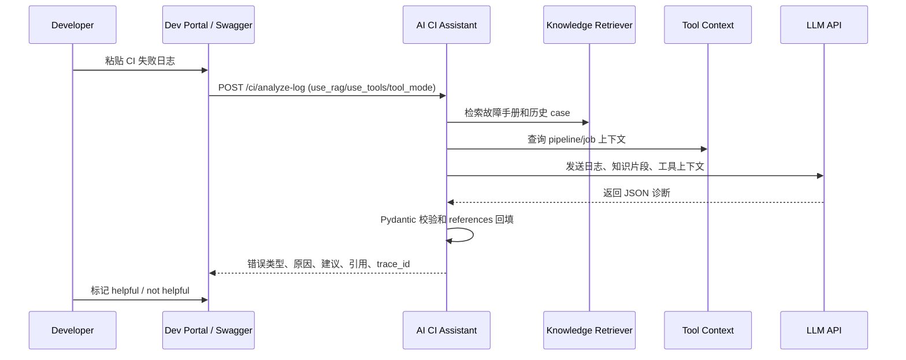
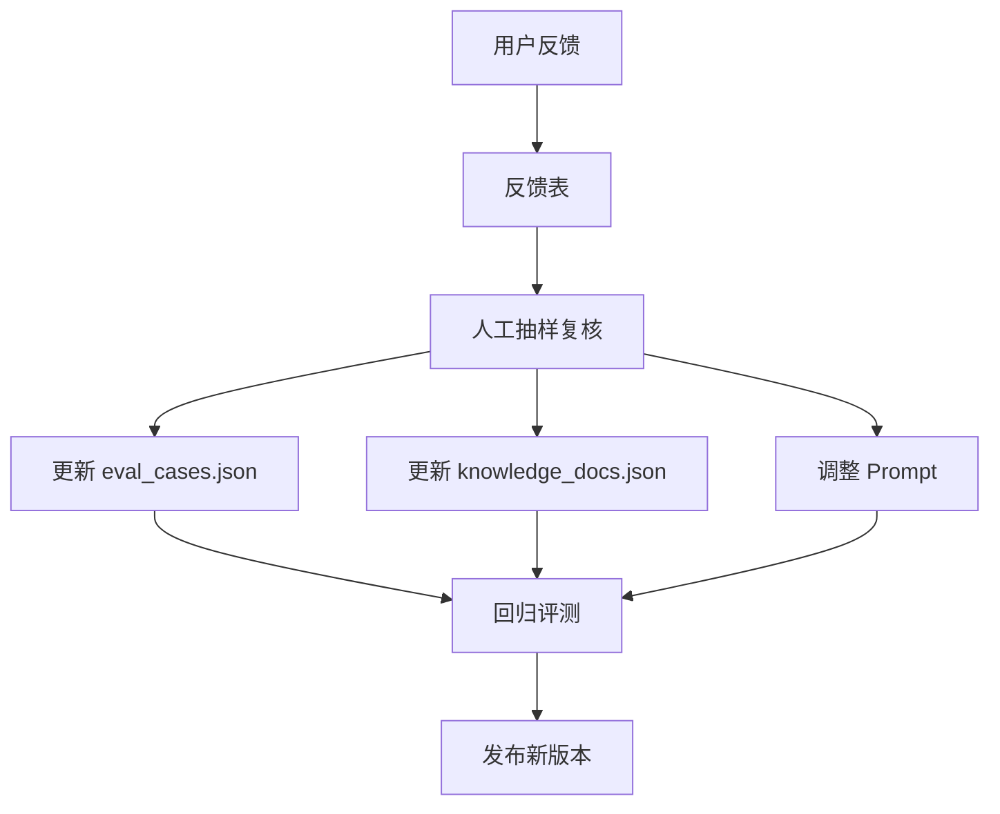

# AI 效能项目产品化设计

## 1. 产品定位

项目名称：AI CI 日志分析助手

产品定位：研发效能平台中的 AI 排障助手。它面向 CI/CD 失败场景，自动读取或接收失败日志，结合知识库和流水线上下文，输出结构化诊断结论、排查建议和引用依据。

目标不是替代开发者，而是把“翻日志、查历史、问同事、总结原因”这段重复劳动压缩成一个可审计、可评测、可持续优化的 AI 工作流。

## 2. 用户与场景

### 开发工程师

典型诉求：

- 快速知道 CI 为什么失败。
- 拿到下一步可执行排查建议。
- 不想在大段日志里手动找关键错误。

成功标准：

- 30 秒内理解失败类型。
- 建议能直接转化为检查动作。
- 引用资料可信，能追溯到团队知识库或历史 case。

### DevOps / 平台工程师

典型诉求：

- 识别团队高频 CI 失败类型。
- 把故障手册和历史经验沉淀进知识库。
- 降低重复咨询和重复排障成本。

成功标准：

- 能看到错误类型分布。
- 能持续更新知识库和评测集。
- 能通过评测判断改 Prompt、改模型还是改检索。

### 技术负责人

典型诉求：

- 降低研发等待时间。
- 衡量 AI 工具是否真的提升效能。
- 让经验沉淀从“人脑记忆”变成“平台资产”。

成功标准：

- 平均排障时间下降。
- 高频失败类型可被统计。
- AI 建议采纳率可衡量。

## 3. 用户使用流程

### 手动分析流程



### 自动接入流程

```mermaid
flowchart LR
    A["CI Job Failed"] --> B["Webhook / GitLab Job API"]
    B --> C["Fetch Job Trace"]
    C --> D["Extract Relevant Lines"]
    D --> E["Mask Secrets"]
    E --> F["RAG + Tool Analyze"]
    F --> G["Structured Diagnosis"]
    G --> H["Comment PR / Notify IM / Create Issue"]
    H --> I["User Feedback"]
    I --> J["Evaluation Set / Knowledge Base Update"]
```



## 4. 核心产品能力

### 日志理解

输入 CI trace，输出：

- `error_type`
- `summary`
- `reason`
- `suggestions`
- `confidence`
- `references`
- `trace_id`
- `fallback_used`

### RAG 知识增强

知识库内容包括：

- CI 故障手册
- 常见错误 FAQ
- 历史失败 case
- 构建规范

设计原则：

- 模型负责分析，不负责编造引用。
- references 由 retriever 的真实 top-k 结果回填。
- 评测时单独统计引用命中率。

### Tool Context / Tool Calling

当前工具体系已经从固定 mock 上下文升级为可注册、可筛选、可执行的 Tool 执行层：

- `ToolSpec`：描述工具名称、参数 schema、provider、tags、read_only、trigger_keywords。
- `CI_TOOLS_SCHEMA`：统一维护工具元信息。
- `ToolsExecutor`：统一注册、筛选、执行、依赖注入、异常隔离和耗时记录。
- `tool_context_service`：基于日志、错误规则、项目和 pipeline 信息动态选择工具。
- `tool_calling_service`：预留 LLM 自主 tool_calls 解析和受控执行。

当前已支持的工具方向：

- 查询历史失败记录。
- 查询 pipeline/job 上下文。
- 查询 GitLab job 上下文。
- 检查依赖文件。
- 查询近期 commits。

后续可替换为真实系统：

- GitLab/Jenkins API。
- 内部构建平台 API。
- 缺陷管理系统。
- 代码仓库和依赖文件读取工具。

产品化原则：

- 读取类工具默认优先，写入类工具必须授权。
- references 和 tool results 都要可追溯。
- 工具结果进入 Prompt 前必须裁剪和脱敏。
- 高风险动作采用“生成建议 + 人工确认 + 审计执行”。

### 评测闭环

评测指标：

- schema 有效率。
- error_type 准确率。
- reference hit rate。
- keyword score。

产品意义：

- 判断输出是否稳定。
- 判断 RAG 是否真的命中资料。
- 判断建议是否覆盖关键排查点。
- 支撑 Prompt、知识库、模型和工具策略迭代。

## 5. 反馈闭环设计

### 用户反馈字段

建议后续新增反馈接口：

```text
POST /ci/feedback
```

核心字段：

- `trace_id`
- `project_name`
- `pipeline_id`
- `job_name`
- `rating`: `helpful | partially_helpful | not_helpful`
- `accepted_suggestion`: `true | false`
- `correct_error_type`
- `comment`

### 反馈使用方式



### 反馈指标

- Helpful rate：用户认为有帮助的比例。
- Accepted suggestion rate：建议被采纳的比例。
- Correction rate：错误类型被用户纠正的比例。
- Repeat failure reduction：同类失败重复出现是否下降。
- MTTR delta：平均排障时间是否下降。

## 6. 权限设计

### 角色

| 角色 | 权限 |
| --- | --- |
| Developer | 分析自己有权限项目的 CI 日志，查看诊断结果 |
| Maintainer | 查看项目级历史分析、提交反馈、维护项目知识库 |
| Platform Admin | 管理全局知识库、模型配置、评测集、审计日志 |
| Auditor | 只读查看审计记录和安全事件 |

### 权限边界

- 用户只能分析自己有权限访问的项目和 job。
- GitLab token 不返回给前端，不写入业务日志。
- PR 评论、issue 创建、pipeline 重跑必须独立授权。
- 默认只输出建议，不自动修改代码或执行危险动作。

## 7. 审计设计

每次分析记录：

- `trace_id`
- 请求时间
- 请求人或 service account
- project / pipeline / job
- endpoint
- use_rag / use_tools
- retrieve_top_k
- rag_hit_titles
- tool_names
- llm_model
- duration_ms
- fallback_used
- error_type
- confidence
- error_message

审计原则：

- 记录元数据，不保存完整敏感 trace。
- 原始日志需要存储时必须脱敏和设置 TTL。
- 模型请求和响应需要按安全策略采样保存。

## 8. 安全边界

### 数据脱敏

当前已有基础 masking：

- `token=...`
- `password=...`
- `secret=...`
- `api_key=...`

后续增强：

- Bearer token。
- 私有仓库 URL 中的 credential。
- 邮箱、手机号、内网域名按需脱敏。
- 超长 trace 截断。

### Prompt Injection 防护

CI 日志可能包含恶意文本，例如“忽略之前指令”。防护策略：

- system prompt 明确日志是不可信输入。
- 日志、知识片段、工具上下文分区传递。
- 输出必须通过 Pydantic schema 校验。
- references 不由模型生成。

### 动作安全

项目当前只做分析，不执行写操作。后续如果加入自动动作：

- PR 评论：低风险，可开启。
- 创建 issue：中风险，需要项目级授权。
- 重跑 pipeline：中高风险，需要 Maintainer 确认。
- 自动提交修复 MR：高风险，需要人工 review。

## 9. 产品化里程碑

### V0 Demo

已完成：

- FastAPI 服务。
- LLM 日志分析。
- RAG 检索。
- Tool Context。
- GitLab Job 接入雏形。
- Pydantic 校验。
- 评测脚本。
- README / Docker / Makefile。

### V1 可试用

目标：

- 接真实 GitLab webhook。
- 增加用户反馈接口。
- 增加项目级知识库。
- 增加基础鉴权。
- 增加审计表。

### V2 可推广

目标：

- Dashboard 展示失败趋势和 AI 效果。
- RAG reranker。
- embedding/index cache。
- 多模型对比评测。
- PR 自动评论。

### V3 Agent 化

目标：

- 标准 Tool Calling。
- 自动读取依赖文件、测试报告和 CI 配置。
- 自动生成 issue 或修复建议 PR。
- 人工确认后执行受控动作。

## 10. Tool 调用产品化路线

Tool 调用的演进路线建议分为四级：

### L1：规则工具上下文

服务端根据错误关键词和请求参数选择工具。

适合当前阶段，因为稳定、可控、容易评测。

### L2：可注册工具平台

所有工具通过 `ToolSpec` 和 schema 注册。

重点能力：

- enabled 开关。
- read_only 标记。
- provider 分类。
- tags 和 trigger_keywords。
- result_trimmer。

### L3：受控 Tool Calling

模型可以提出工具调用，但后端负责：

- 校验工具是否存在。
- 校验参数 schema。
- 校验用户权限。
- 限制最大调用次数。
- 记录审计日志。

### L4：人机协同动作执行

写入动作不直接自动执行，而是：

```text
模型提出动作建议
  ↓
后端校验权限和风险
  ↓
用户确认
  ↓
工具执行
  ↓
审计记录
```

这样可以支持 PR 评论、issue 创建、pipeline 重跑、修复 MR 草稿等能力，同时守住工程安全边界。
