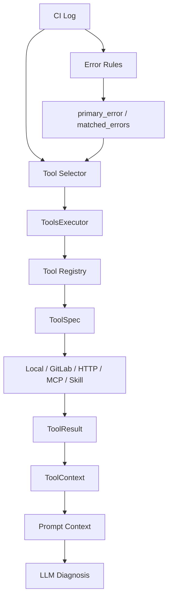

# Tool 调用优化全过程

> 2026-07-16 更新：GitLab Job 入口改为最小启动数据采集，并增加请求级预取数据复用。

## 1. 为什么要优化 Tool 调用

项目早期的 Tool Context 只是服务端根据日志关键词固定查询两个 mock 工具：

- 历史失败记录
- pipeline/job 上下文

这种方式适合 Demo 起步，但继续做下去会遇到几个问题：

- 工具越来越多后，路由或 service 里会堆大量 `if/else`。
- 每个工具的入参、返回结构、异常处理不统一。
- 工具是否可用、是否只读、适合什么场景，没有统一元信息。
- 后续接 GitLab、Jenkins、数据库、HTTP API、MCP、Skill 时缺少统一扩展点。
- 面试里很难讲成“Agent 工具系统”，更像临时拼接上下文。

所以这轮优化的目标是：从“固定规则上下文”升级为“可注册、可筛选、可执行、可治理的 Tool 调用体系”。

## 2. 优化前链路

早期链路：

```text
log_text
  ↓
extract keyword
  ↓
固定调用 query_failure_history / query_pipeline_context
  ↓
拼进 prompt
  ↓
LLM 分析
```

优点：

- 简单直观。
- 容易调试。
- 不依赖模型自主选择工具。

缺点：

- 新增工具需要改业务流程代码。
- 工具选择逻辑分散。
- 工具返回结构不统一。
- 无法清晰描述工具权限、provider、tags、trigger_keywords。
- 难以升级为标准 Tool Calling。

## 3. 优化后整体架构



核心模块：

- `tools/base.py`：定义 `ToolSpec`、`ToolResult`、`ToolContext`、`ToolRuntimeContext`、`LLMToolCall`。
- `tools/schemas.py`：统一维护工具 schema，是工具元信息的单一事实源。
- `tools/register.py`：把 schema 映射到真实函数，并注册进 executor。
- `tools/executor.py`：统一执行工具、注入依赖、隔离异常、记录耗时、裁剪结果。
- `tools/rules.py`：维护错误关键词规则，提取结构化错误信号。
- `services/tool_context_service.py`：根据日志、项目、pipeline、job 选择工具并收集上下文。
- `services/tool_calling_service.py`：解析模型返回的 tool_calls，并受控执行。

## 4. 优化步骤

### 4.1 第一步：抽象 ToolSpec

`ToolSpec` 把每个工具从“一个函数”升级为“带元信息的能力”。

关键字段：

- `name`：工具名。
- `description`：给模型或开发者看的工具说明。
- `func`：真实执行函数。
- `parameters_schema`：参数 JSON Schema。
- `provider`：工具来源，如 `local`、`http`、`mcp`、`skill`。
- `enabled`：是否启用。
- `read_only`：是否只读。
- `tags`：场景标签。
- `trigger_keywords`：适合触发该工具的关键词。
- `always_candidate`：是否总是作为候选工具。
- `result_trimmer`：结果裁剪函数。

优点：

- 工具能力显式化。
- 工具可以被筛选、审计和治理。
- 后续接入外部工具不需要改变业务主流程。

### 4.2 第二步：统一工具 Schema

`CI_TOOLS_SCHEMA` 统一描述工具：

- `query_failure_history`
- `query_pipeline_context`
- `query_job_context`
- `check_dependency_file`
- `query_recent_commits`

每个工具声明：

- description
- provider
- tags
- read_only
- enabled
- trigger_keywords
- parameters

优点：

- schema 是单一事实源。
- 可以转换成 OpenAI-compatible tools schema。
- 可以用于 UI 展示、权限配置和评测。
- 参数不再散落在调用代码里。

### 4.3 第三步：引入 ToolsExecutor

`ToolsExecutor` 负责：

- 注册工具。
- 根据 tag、关键词、provider、read_only 过滤工具。
- 执行单个工具。
- 执行多个工具。
- 给工具注入依赖，比如 `gitlab_client`。
- 捕获工具异常，避免单个工具打崩整个分析链路。
- 记录每个工具耗时。
- 对工具结果做裁剪。

执行结果统一为：

```text
ToolResult(
  tool_name,
  success,
  data,
  error,
  duration_ms
)
```

优点：

- 工具执行入口统一。
- 未知工具不会让系统崩溃。
- 单个工具异常不会影响其他工具。
- 工具耗时可观测。
- 结果结构可直接进入 prompt 或审计日志。

### 4.3.1 请求级运行时上下文

GitLab Job 分析入口必须先获取 Job Trace，否则模型没有日志可用于错误识别和工具选择；但预取的 Job 可能随后被 `query_job_context` 再查一次。为避免重复 API 调用，执行器支持随单次请求传递 `ToolRuntimeContext`。

```text
GitLab bootstrap
  -> prefetched job
  -> ToolRuntimeContext
  -> ToolsExecutor dependency injection
  -> query_job_context
       ├── cache hit：直接裁剪并返回
       └── cache miss：调用 GitLab API
```

`ToolRuntimeContext` 不属于模型可见的 Tool Schema，也不保存在全局 executor 中。它只由服务端依赖注入，因此不会增加模型参数复杂度，也不会造成并发请求缓存污染。工具结果通过 `data_source=request_cache|gitlab_api` 记录真实数据来源。

### 4.4 第四步：规则提取错误关键词

`tools/rules.py` 把错误识别规则集中维护。

当前支持：

- `ModuleNotFoundError` -> `dependency_missing`
- `403 / Forbidden / Unauthorized` -> `repo_auth_failed`
- `AssertionError` -> `test_failed`
- `SyntaxError` -> `syntax_error`
- `KeyError` -> `env_config_error`
- `timeout` -> `timeout`

优点：

- 错误规则集中维护。
- 后续可以加优先级、命中统计和评测。
- 工具选择可以基于结构化错误，而不是到处写正则。

### 4.5 第五步：动态选择工具

`build_tool_calls` 会结合：

- 日志文本
- primary_error
- project_name
- pipeline_id
- job_name
- 工具 tags
- trigger_keywords
- read_only 限制

动态决定需要调用哪些工具。

示例：

```text
ModuleNotFoundError: No module named requests
```

可能触发：

- `query_failure_history`
- `check_dependency_file`
- `query_recent_commits`

如果同时传了 pipeline/job 信息，还可能触发：

- `query_pipeline_context`

优点：

- 工具调用更贴合场景。
- 不需要所有请求都调用所有工具。
- 能控制 prompt 上下文长度和外部 API 成本。

### 4.6 第六步：结果裁剪

工具原始结果可能很大，不适合直接进 prompt。

`trim_tool_result` 会对不同工具返回做裁剪：

- 历史失败只保留前 3 条。
- pipeline jobs 只保留前 10 个。
- commit 只保留少量关键字段。
- GitLab job/pipeline 只保留诊断必要信息。

优点：

- 降低 token 成本。
- 减少噪声。
- 降低敏感信息泄漏风险。
- 让 Prompt 更聚焦诊断。

### 4.7 第七步：预留自主 Tool Calling

`tool_calling_service.py` 做了两件事：

- 解析 LLM 返回的 `tool_calls`。
- 通过 `ToolsExecutor` 受控执行模型请求的工具。

这意味着项目已经有两种工具模式：

```text
规则版 Tool Context：服务端决定调用什么工具
自主 Tool Calling：模型提出工具调用，服务端受控执行
```

当前更推荐生产优先使用规则版，因为稳定、可控、容易审计。自主 Tool Calling 可以作为后续进阶能力。

## 5. 当前 Tool 调用链路

```text
用户请求
  ↓
FastAPI Router
  ↓
tool_context_service.collect_tool_context
  ↓
rules.extract_error_keywords
  ↓
ToolsExecutor.select_tool_names
  ↓
build_tool_calls
  ↓
ToolsExecutor.execute_many
  ↓
ToolResult 列表
  ↓
ToolContext.to_prompt_context
  ↓
RAG + Tool Prompt
  ↓
LLM 输出结构化诊断
```

## 6. 对应优点总结

### 工程可维护性

新增工具时只需要：

1. 实现工具函数。
2. 在 `CI_TOOLS_SCHEMA` 增加 schema。
3. 在 `TOOL_FUNCTIONS` 映射函数。

业务主流程不需要大改。

### 可观测性

每个工具都有：

- tool_name
- success
- error
- duration_ms

后续可以统计：

- 哪些工具最常被调用。
- 哪些工具失败率最高。
- 哪些工具耗时最大。
- 哪些工具对用户采纳率贡献最大。

### 安全性

当前工具默认强调：

- `read_only`
- `enabled`
- provider 白名单
- result trimming
- unknown tool 隔离
- 单工具异常隔离

这让系统在升级为 Agent 时，不会直接失控执行危险动作。

### 面试表达价值

这个设计可以从“我会调 API”升级为：

> 我设计了一个可注册、可筛选、可执行、可审计的工具执行层，把 RAG 的知识增强和 Tool Calling 的运行时上下文分开治理。早期用规则选择保证稳定性，后续可以平滑升级到模型自主 Tool Calling。

## 7. 如何结合实际工程

### 接 GitLab / Jenkins

读取类工具可以优先生产化：

- 查询 job 信息。
- 查询 pipeline 信息。
- 拉取 job trace。
- 查询最近 commits。
- 读取依赖文件。
- 查询 MR 信息。

这些工具风险较低，适合自动调用。

### 接内部研发平台

可以扩展：

- 查询服务负责人。
- 查询服务依赖关系。
- 查询最近发布记录。
- 查询配置变更记录。
- 查询历史故障库。

这样 AI 诊断会更贴近真实业务上下文。

### 接工单和通知系统

写入类工具要分级授权：

- PR 评论：低风险。
- IM 通知：低风险。
- 创建 issue：中风险。
- 重跑 pipeline：中高风险。
- 自动提交 MR：高风险。

建议先做“生成草稿 + 人工确认”，不要一开始自动执行。

## 8. 后续进一步优化

### 8.1 工具权限系统

增加：

- user role
- project permission
- tool risk level
- action approval
- audit log

让工具执行从“代码可控”升级为“产品可控”。

### 8.2 工具选择评测

为每条 eval case 标注期望工具：

```json
{
  "expected_tools": [
    "query_failure_history",
    "check_dependency_file"
  ]
}
```

新增指标：

- tool selection precision
- tool selection recall
- tool success rate
- tool latency p95

### 8.3 工具结果质量评估

不只看工具有没有执行，还要看结果有没有用：

- 是否命中正确依赖文件。
- 是否查到相关历史 case。
- 是否定位到正确 job。
- 是否减少模型幻觉。

### 8.4 引入 Tool Calling 决策层

可以采用混合策略：

```text
高置信规则工具：服务端直接调用
低置信探索工具：让模型选择
高风险写入工具：模型只能申请，用户确认后执行
```

这样兼顾稳定性和灵活性。

### 8.5 支持更多 Provider

当前 executor 只实现 `local`。

后续可以扩展：

- `http`：内部平台 API。
- `mcp`：MCP 工具。
- `skill`：Codex/Agent skill。
- `queue`：异步任务。

### 8.6 工具结果缓存

适合缓存：

- pipeline/job context。
- 最近 commits。
- 依赖文件内容。
- 历史失败查询。

缓存可以降低外部 API 压力，也能提升响应速度。

### 8.7 写入动作的人机协同

把写入动作设计成两阶段：

```text
LLM 生成 action proposal
  ↓
后端校验权限和风险
  ↓
用户确认
  ↓
工具执行
  ↓
审计记录
```

这更符合真实企业工程安全要求。

## 9. 阶段性结论

Tool 调用优化的核心价值是：把“临时查几个上下文”升级为“Agent 可用的工具执行底座”。

它让项目具备了三个关键能力：

- 可扩展：新增工具不侵入主流程。
- 可治理：工具有 schema、权限、只读标识、provider 和结果裁剪。
- 可演进：可以从规则工具平滑升级到受控 Tool Calling。

这也是这个项目从 AI Demo 走向 AI Agent 工程项目的重要一步。
